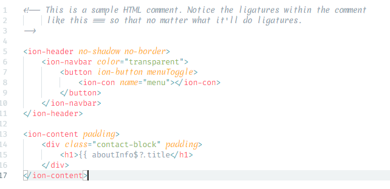
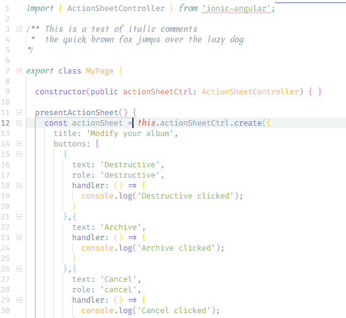

# Fira Code mScript
Fira Code mScript is a font hybrid with ligatures as well as a nice script style font for italics, allowing a distinct visual difference for keywords and comments (with appropriate style theme applied).

The regular and bold fonts (and where the ligatures are from) are from [Fira Code](https://github.com/tonsky/FiraCode); the italic is from [Merienda](https://www.fontsquirrel.com/fonts/merienda).

### New Characters
I'm really picky so I changed the following characters I didn't like.

## Installation
Download the distribution folder and install the ttf fonts in there. Make sure you have an editor theme that supports both italics and ligature. Finally, in your editor, set the font to 'Fira Code iScript' and set ligatures to true.

## Inspired by Fira Code
This is using Fira Code 1.205. Thanks @tonsky !